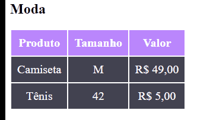

# Desafio 4 tabela estilizada
- Para os títulos utilizei a tag h2.
- Para as tabelas utilizei as tags table, tr, th e td, conforme ensinado durante as aulas.
- Para estilizar de uma maneira mais fácil atribui classes para algumas tags.
- No CSS a estilização foi feita como recomendado no desafio, bem tranquilo de fazer, mesmo que o enunciado não tenha pedido, coloquei "text-aling: center" para dar uma cara melhor no conteúdo das tabelas. 

[  ]
## Tecoligias utilizadas
- HTML
- CSS
